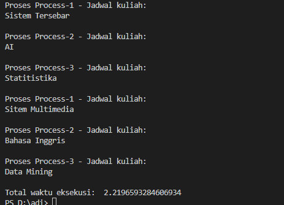
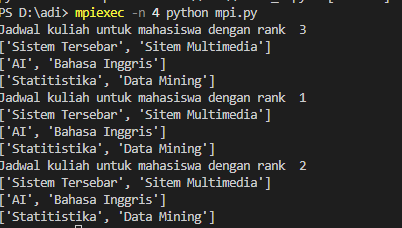

Hasil dari Soal ke 1
Program ini akan mencetak jadwal kuliah untuk setiap kursus yang diberikan dalam daftar 'courses', dengan menggunakan multiprocessing untuk memproses setiap kursus secara bersamaan. Setiap jadwal kuliah akan dicetak dalam format 'Hari: Waktu', dengan jeda waktu 2 detik antara setiap cetakan. Setelah semua proses selesai, program akan mencetak pesan "Selesai membuat jadwal kuliah untuk semua kursus." sebagai tanda program telah selesai dieksekusi.

Hasil dari Soal ke 2
Program tersebut menggunakan multiprocessing untuk memproses setiap jadwal kuliah yang ada dalam daftar 'jadwal_kuliah' secara bersamaan. Setiap jadwal kuliah akan dicetak dengan jeda waktu 1 detik antara setiap proses untuk mensimulasikan pengolahan data yang sebenarnya. Setelah semua proses selesai, program akan mencetak waktu yang dibutuhkan untuk mengeksekusi semua proses

Hasil dari Soal ke 3
Program menggunakan MPI untuk melakukan komunikasi antar proses. Proses dengan rank 0 akan mengirimkan data jadwal kuliah ke proses dengan rank di atas 0, sedangkan proses dengan rank selain 0 akan menerima data jadwal kuliah dan mencetaknya di layar. Setiap proses dengan rank di atas 0 akan mencetak jadwal kuliah untuk mahasiswa dengan nomor rank mereka, dan kemudian mencetak jadwal kuliah yang diterima dari proses dengan rank 0.

